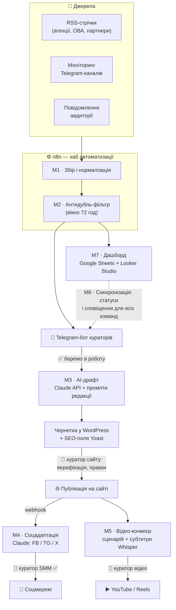
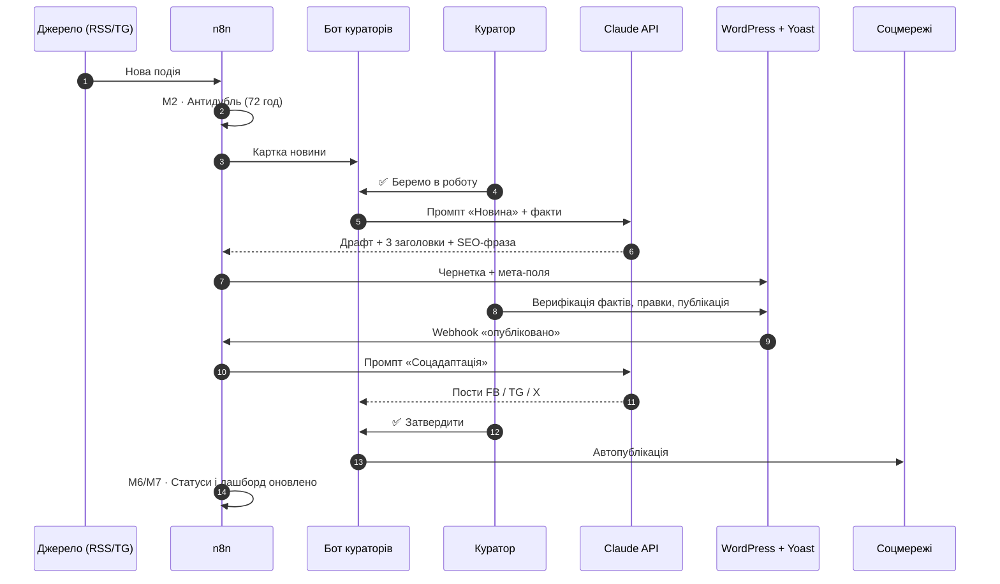
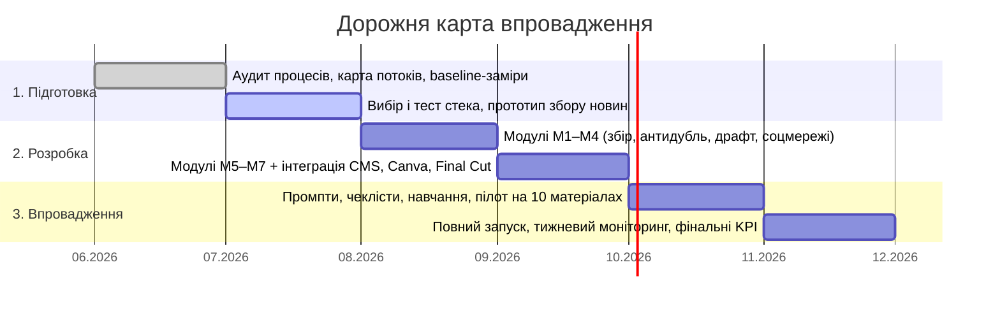

# 📰 «Новини Донбасу» — автоматизація редакції

Єдина автоматизована система виробництва контенту для трьох редакційних команд — **сайт, соцмережі, відео**. Тут зібрано техстек, схеми процесів, готові до імпорту n8n-воркфлоу, промпти редакції та чеклісти кураторів.

**▶️ Інтерактивний симулятор конвеєра:** https://alexmazuka.github.io/nd-newsroom-automation/

> Принцип системи: **рутину виконують автоматизації, рішення ухвалюють куратори.** Жоден матеріал не публікується без людини — на кожному критичному етапі стоїть ручне затвердження.

---

## 🎯 Цілі (KPI)

| Показник | Зараз (baseline) | Ціль |
|---|---|---|
| Час на один матеріал | 2–3 год | **15–30 хв** |
| Дублювання роботи між командами | ручні копіпасти | **−50%** |
| Одночасні публікації в 3 каналах (сайт + соцмережі + відео) | рідко | **+30%** |
| Обсяг якісного контенту | — | **+30%** |
| Використання системи кураторами | — | **100%** |

---

## 🗺 Архітектура системи



## 🔁 Життєвий цикл одного матеріалу



---

## 🧰 Техстек

| Шар | Інструмент | Роль у системі | Вартість |
|---|---|---|---|
| CMS | **WordPress + REST API** | існуючий сайт; чернетки та публікації через API | 0 |
| Керування сайтом | **WPVibe** | AI-керування WordPress (REST, WP-CLI, масові операції) через Claude | 0 (Free-план) |
| SEO | **Yoast SEO** (free) | мета-теги, sitemap; focus keyphrase підставляється з AI-драфта | 0 |
| Хаб автоматизації | **n8n** (self-hosted) | уся логіка модулів М1–М7; необмежені операції; дані під контролем редакції | 0 + VPS ~$5–6/міс |
| Фолбек-хаб | Make.com (free) | запасний варіант без VPS: 1000 операцій/міс | 0 |
| AI-ядро | **Claude API** (Anthropic) | драфти, соцадаптація, заголовки, SEO-фрази, сценарії відео | див. таблицю нижче |
| Інтерфейс кураторів | **Telegram Bot API** | картки новин, кнопки ✅/❌, сповіщення — команда вже живе в Telegram | 0 |
| Дашборд | **Google Sheets + Looker Studio** | статуси матеріалів у реальному часі, журнал антидубля, метрики | 0 |
| База знань | **Notion** | SOP, промпти, чеклісти (вже впроваджується в редакції) | 0 |
| Графіка | **Canva** (Brand Kit) | шаблони обкладинок і карток для соцмереж | наявний план |
| Відео | **Final Cut Pro** + шаблони | монтаж за шаблонами проєкту | наявна ліцензія |
| Транскрибація | **Whisper** (локально) | субтитри до відео; аудіо не покидає комп'ютер редакції | 0 |
| Аналітика | **GA4** + соцметрики → Sheets | M&E-план: охоплення, залучення | 0 |

### Моделі Claude і вартість

| Модель | ID для API | Вхід, $/1M ток. | Вихід, $/1M ток. | Коли використовувати |
|---|---|---|---|---|
| Claude Opus 4.8 | `claude-opus-4-8` | $5 | $25 | **за замовчуванням у воркфлоу** — найякісніші драфти й адаптації |
| Claude Sonnet 5 | `claude-sonnet-5` | $3 (інтро $2 до 31.08.2026) | $15 (інтро $10) | баланс якість/ціна на великих обсягах |
| Claude Haiku 4.5 | `claude-haiku-4-5` | $1 | $5 | економ-режим: соцадаптація, заголовки, теги |

**Орієнтовний бюджет:** при ~900 матеріалах/міс (30/день) і ~10 тис. токенів входу + 4 тис. виходу на матеріал: Opus ≈ **$135/міс**, Sonnet ≈ **$81** (інтро ≈ $54), Haiku ≈ **$27**. Перемкнути модель = змінити одне поле `model` у воркфлоу. Разом із VPS повна вартість володіння системою — **від ~$32/міс**.

---

## 🧩 Модулі системи (М1–М7)

| № | Модуль | Що робить | Інструменти | Хто вирішує |
|---|---|---|---|---|
| М1 | Збір новин | RSS, Telegram-канали, повідомлення авдиторії → нормалізована картка новини | n8n | ⚙️ авто |
| М2 | Антидубль | звіряє нові події з журналом за 72 год; сумнівні позначає «можливий дубль» | n8n + Sheets | ⚙️ авто → 🧑 куратор |
| М3 | AI-драфт | чернетка новини + 3 заголовки + SEO-фраза + мета-опис за фактами; чого бракує — позначка `[ПЕРЕВІРИТИ]` | Claude API | 🧑 куратор сайту |
| М4 | Соцадаптація | після публікації — версії поста під Facebook / Telegram / X | Claude API + бот | 🧑 куратор SMM |
| М5 | Відео-конвеєр | таск на сюжет: сценарій, шотліст, титри; субтитри — Whisper; монтаж — Final Cut | Claude + Whisper + FCP | 🧑 куратор відео |
| М6 | Синхронізація команд | один статус-рядок на матеріал: ідея → драфт → сайт → соцмережі → відео; сповіщення при зміні; ранковий дайджест «що в роботі» | n8n + бот | ⚙️ авто |
| М7 | Дашборд | реальний час: хто над чим працює, час на матеріал, лічильник дублів, публікації по каналах | Sheets + Looker Studio | ⚙️ авто |

---

## 🗓 Дорожня карта (червень — листопад 2026)



### Практичні кроки по місяцях

**Місяць 1 — Підготовка (червень) ✅**
- [x] Карта поточних процесів трьох команд (збір → написання → оформлення → верифікація → публікація)
- [x] Baseline-заміри: скільки часу йде на матеріал зараз (2–3 год)
- [x] Структура дашборда і статусної моделі

**Місяць 2 — Техстек (липень) ← ми тут**
- [ ] Розгорнути n8n (VPS + Docker, [інструкція](workflows/README.md)) або завести Make.com як фолбек
- [ ] Створити Telegram-бота кураторів (@BotFather) і чати команд
- [ ] Отримати ключ Claude API (console.anthropic.com), поставити ліміт витрат
- [ ] Підключити сайт НД до WPVibe; перевірити/активувати Yoast SEO (free)
- [ ] Створити Application Password у WordPress для REST API
- [ ] **Тест:** імпортувати [3 готові воркфлоу](workflows/) і прогнати тестову новину

**Місяць 3 — Модулі М1–М4 (серпень)**
- [ ] М1: підключити всі RSS-джерела і Telegram-канали моніторингу
- [ ] М2: журнал антидубля в Sheets + автоочищення 72 год
- [ ] М3: фінальні промпти редакції (базові — в [prompts/](prompts/)), поля Yoast через REST
- [ ] М4: webhook «опубліковано» → соцверсії → затвердження в боті → автопостинг

**Місяць 4 — Модулі М5–М7 (вересень)**
- [ ] М5: Whisper локально, шаблони Final Cut, таски на сюжети
- [ ] М6: статусна модель наскрізь, ранковий дайджест о 9:00
- [ ] М7: Looker Studio-дашборд поверх Sheets
- [ ] Інтеграція Canva-шаблонів (обкладинки за брендбуком)

**Місяць 5 — Навчання і пілот (жовтень)**
- [ ] Навчання кураторів (чеклісти — в [checklists/](checklists/))
- [ ] **Пілот на 10 реальних матеріалах** за [протоколом](tests/pilot-plan.md) із замірами часу
- [ ] Корекція промптів і воркфлоу за результатами

**Місяць 6 — Повний запуск (листопад)**
- [ ] Всі матеріали через систему; щотижневий моніторинг
- [ ] Фінальні заміри KPI (порівняння з baseline)
- [ ] Передача підтримки: документація в Notion, куратори оновлюють промпти самостійно

---

## 🧪 Як протестувати вже сьогодні

1. **Симулятор конвеєра** — https://alexmazuka.github.io/nd-newsroom-automation/ — натисніть «Запустити тестову новину» і подивіться, як матеріал проходить усі модулі та де підключаються куратори. Там само — чеклісти й промпти з копіюванням в один клік.
2. **Реальний тест у n8n** — імпортуйте JSON із папки [workflows/](workflows/) (15 хвилин за [покроковою інструкцією](workflows/README.md)): RSS → картка в Telegram → AI-чернетка у WordPress.
3. **Тест промптів без інфраструктури** — скопіюйте будь-який промпт із [prompts/](prompts/) у Claude і вставте факти реальної новини.
4. **Пілот-протокол** — [tests/pilot-plan.md](tests/pilot-plan.md): як виміряти ефект на 10 матеріалах.

---

## 📁 Структура репозиторію

```
├── README.md                      ← ця сторінка
├── docs/index.html                ← інтерактивний симулятор (GitHub Pages)
├── workflows/                     ← готові n8n-воркфлоу: імпорт → тест
│   ├── 01-news-intake.json        ← М1+М2: RSS → антидубль → картка в Telegram
│   ├── 02-draft-to-wordpress.json ← М3: факти → Claude → чернетка у WordPress
│   ├── 03-publish-to-social.json  ← М4: публікація → соцверсії → куратору SMM
│   └── README.md                  ← покрокова інструкція запуску і тестування
├── prompts/                       ← промпти редакції для Claude (М3–М5)
├── checklists/                    ← чеклісти кураторів: сайт, SMM, відео
└── tests/pilot-plan.md            ← протокол пілота на 10 матеріалах
```

## 📍 Поточний стан (03.07.2026)

- Сайт на WordPress працює; акаунт WPVibe активний — **сайт НД ще не підключено** (крок місяця 2)
- Yoast SEO — перевірити/активувати free-версію
- Команди вже використовують Canva, Google Sheets, Final Cut; Notion впроваджується
- Baseline зафіксовано: 2–3 год на матеріал

## 🔒 Безпека і верифікація

- **Куратор — обов'язкова ланка:** AI ніколи не публікує сам; кнопка «опублікувати» завжди в людини.
- **Верифікація з ТОТ:** мінімум два незалежні підтвердження, ручний протокол — автоматизація лише нагадує чеклістом, не вирішує.
- **Ключі:** Claude API, Telegram-токен, WP Application Password — тільки в n8n Credentials / змінних середовища, ніколи в тексті воркфлоу чи репозиторії.
- **Доступ до бота:** whitelist за chat_id кураторів.
- **Аудіо/відео:** транскрибація Whisper локально — чутливий контент не іде в хмару.
- **Публічність:** у цьому репозиторії немає ключів, персональних даних, джерел і внутрішніх протоколів безпеки.

---

*Репозиторій — технічна документація проєкту цифрової трансформації редакції «Новини Донбасу», 2026. English summary: a unified automation system for a three-team newsroom (web, social, video): free/open tech stack (n8n, Claude API, Telegram bot, WordPress + Yoast + WPVibe, Sheets, Whisper), 7 interconnected modules with mandatory curator approval gates, importable n8n workflows, editorial prompts, curator checklists and a 10-story pilot protocol.*
